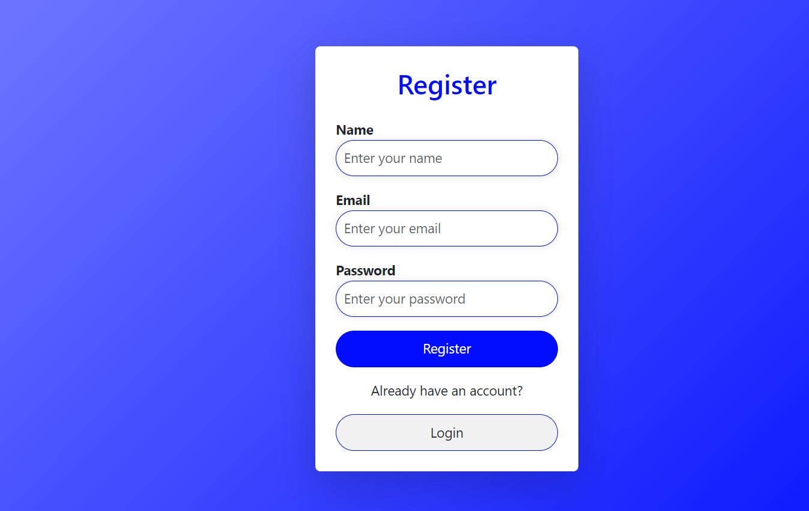
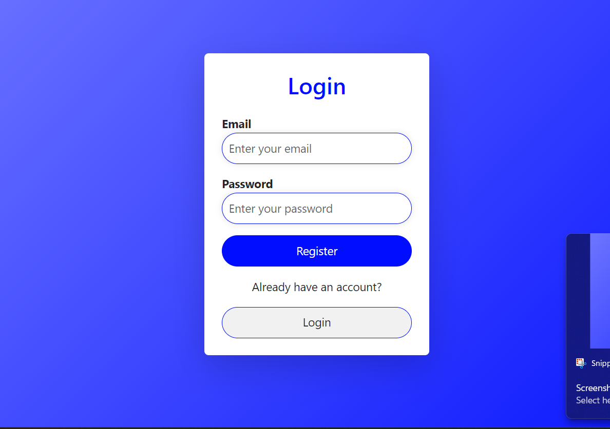

# MERN Signup Page

This is a simple user registration (signup) page built using the MERN (MongoDB, Express, React, Node.js) stack. It allows users to create accounts by submitting their personal information, which is then stored in a MongoDB database.

## Features

- User registration with validation
- Password hashing for secure storage
- Responsive UI for an optimal experience on all devices
- Frontend developed with React
- Backend API built using Node.js and Express
- Data stored in MongoDB


## Output img 




## Tech Stack

- **Frontend**: React, CSS
- **Backend**: Node.js, Express
- **Database**: MongoDB
- **Authentication**: JWT (JSON Web Token) for secure authentication
- **Password Hashing**: Bcrypt.js for encrypting passwords

## Installation

### Prerequisites

Before you begin, ensure you have the following installed on your local machine:

- [Node.js](https://nodejs.org/en/)
- [MongoDB](https://www.mongodb.com/)
- [Git](https://git-scm.com/)

### Clone the repository

```bash
git clone https://github.com/kisun-sah/SignUp-Page.git
cd SignUp-Page
